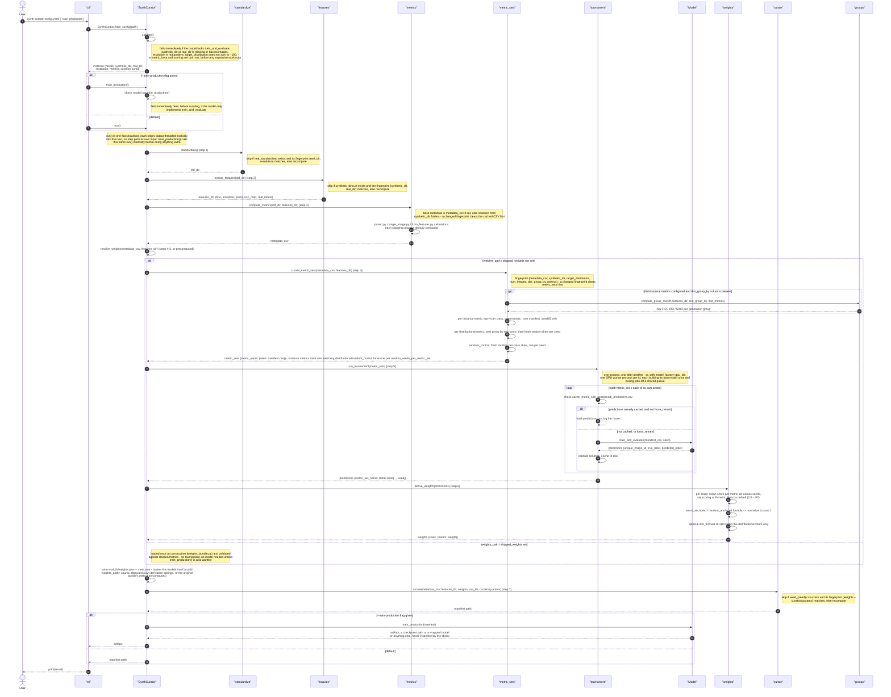

```mermaid
%%{init: {'theme': 'default'}}%%
sequenceDiagram
    autonumber
    actor User
    participant CLI as "cli"
    participant SC as "SynthCurator"
    participant STD as "standardize"
    participant FEAT as "features"
    participant MET as "metrics"
    participant MS as "metric_sets"
    participant TOUR as "tournament"
    participant MODEL as "Model"
    participant WGT as "weights"
    participant CUR as "curate"
    participant GRP as "groups"

    User->>CLI: synth-curator config.yaml [--train-production]
    CLI->>SC: SynthCurator.from_config(path)
    SC->>SC: _validate()
    Note right of SC: fails immediately if the model lacks train_and_evaluate,<br/>synthetic_dir or real_dir is missing or has no images,<br/>resolution is not positive, target_distribution does not sum to ~100,<br/>or metric_beta and scoring are both set, before any expensive work runs
    SC-->>CLI: instance (model, synthetic_dir, real_dir,<br/>resolution, metrics, curation config)

    alt --train-production flag given
        CLI->>SC: train_production()
        SC->>SC: check model has train_production()
        Note right of SC: fails immediately here, before curating, if the model only<br/>implements train_and_evaluate
    else default
        CLI->>SC: run()
    end

    Note over SC: run() is one flat sequence, each step's output threaded explicitly<br/>into the next, no step pulls its own input. train_production() calls<br/>this same run() internally before doing anything extra

    SC->>STD: standardize() [step 1]
    Note right of STD: skip if real_standardized exists and its fingerprint (real_dir,<br/>resolution) matches, else recompute
    STD-->>SC: std_dir

    SC->>FEAT: extract_features(std_dir) [step 2]
    Note right of FEAT: skip if synthetic_dino.pt exists and the fingerprint (synthetic_dir,<br/>real_dir) matches, else recompute
    FEAT-->>SC: features_dir (dino, inception, probs, knn_map, real_labels)

    SC->>MET: compute_metrics(std_dir, features_dir) [step 3]
    Note right of MET: base metadata is metadata_csv if set, else scanned from<br/>synthetic_dir folders - a changed fingerprint clears the cached CSV first
    MET->>MET: paired.py / single_image.py / from_features.py calculators,<br/>each skipping columns already computed
    MET-->>SC: metadata_csv

    SC->>SC: resolve_weights(metadata_csv, features_dir) [steps 4-6, or precomputed]
    alt weights_path / shipped_weights not set
        SC->>MS: curate_metric_sets(metadata_csv, features_dir) [step 4]
        Note right of MS: fingerprint (metadata_csv, synthetic_dir, target_distribution,<br/>num_images, dist_group_by, metrics) - a changed fingerprint clears<br/>metric_sets/ first
        opt distributional metrics configured and dist_group_by columns present
            MS->>GRP: compute_group_raw(df, features_dir, dist_group_by, dist_metrics)
            GRP-->>MS: raw FID / KID / SWD per generation group
        end
        MS->>MS: per instance metric: top-N per class, deterministic - one manifest, seed[0] only
        MS->>MS: per distributional metric: best group by raw score, then fresh random draw per seed
        MS->>MS: random_control: fresh random per-class draw, one per seed
        MS-->>SC: metric_sets {metric_name: {seed: manifest.csv}} - instance metrics have one seed key, distributional/random_control have one per random_seeds_per_metric_set

        SC->>TOUR: run_tournament(metric_sets) [step 5]
        Note right of TOUR: one process, one after another - or, with model_factory+gpu_ids,<br/>one GPU worker process per id, each building its own model once and<br/>pulling jobs off a shared queue
        loop each metric_set x each of its own seeds
            TOUR->>TOUR: check cache {metric_set}_seed{seed}_predictions.csv
            alt predictions already cached and not force_retrain
                TOUR-->>TOUR: load predictions.csv, log the reuse
            else not cached, or force_retrain
                TOUR->>MODEL: train_and_evaluate(manifest_csv, seed)
                MODEL-->>TOUR: predictions (unique_image_id, true_label, predicted_label)
                TOUR->>TOUR: validate columns, cache to disk
            end
        end
        TOUR-->>SC: predictions {metric_set_name: DataFrame[..., seed]}

        SC->>WGT: derive_weights(predictions) [step 6]
        WGT->>WGT: per class: mean score per metric set across seeds,<br/>via scoring or F-metric_beta by default (2.0 = F2)
        WGT->>WGT: worst_anchored / random_anchored formula -> normalize to sum 1
        WGT->>WGT: optional dist_formula re-split within the distributional share only
        WGT-->>SC: weights {class: {metric: weight}}
    else weights_path / shipped_weights set
        Note right of SC: loaded once at construction (weights_bundle.py) and validated<br/>against classes/metrics - no tournament, no model needed unless<br/>train_production() is also wanted
    end
    SC->>SC: write workdir/weights.json + meta.json - makes this workdir itself a valid<br/>weights_path= source afterward (own derivation settings, or the original<br/>bundle's meta if precomputed)

    SC->>CUR: curate(metadata_csv, features_dir, weights, out_dir, curation params) [step 7]
    Note right of CUR: skip if seed_{seed}.csv exists and its fingerprint (weights +<br/>curation params) matches, else recompute
    CUR-->>SC: manifest path

    alt --train-production flag given
        SC->>MODEL: train_production(manifest)
        MODEL-->>SC: artifact, a checkpoint path or a wrapped model<br/>or anything else, never inspected by the library
        SC-->>CLI: artifact
    else default
        SC-->>CLI: manifest path
    end
    CLI-->>User: print(result)
```
