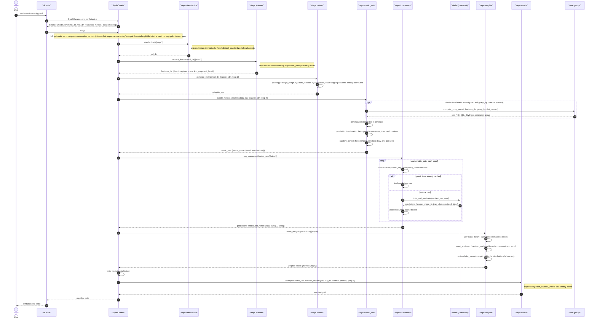

```mermaid
%%{init: {'theme': 'default'}}%%
sequenceDiagram
    autonumber
    actor User
    participant CLI as "cli.main"
    participant SC as "SynthCurator"
    participant STD as "steps.standardize"
    participant FEAT as "steps.features"
    participant MET as "steps.metrics"
    participant MS as "steps.metric_sets"
    participant TOUR as "steps.tournament"
    participant MODEL as "Model (user code)"
    participant WGT as "steps.weights"
    participant CUR as "steps.curate"
    participant GRP as "core.groups"

    User->>CLI: synth-curator config.yaml
    CLI->>SC: SynthCurator.from_config(path)
    SC-->>CLI: instance (model, synthetic_dir, real_dir, resolution, metrics, curation config)
    CLI->>SC: run()

    Note over SC: full path only, no bring-your-own-weights yet - run() is one flat sequence, each step's output threaded explicitly into the next, no step pulls its own input

    SC->>STD: standardize() [step 1]
    Note right of STD: skip and return immediately if workdir/real_standardized already exists
    STD-->>SC: std_dir

    SC->>FEAT: extract_features(std_dir) [step 2]
    Note right of FEAT: skip and return immediately if synthetic_dino.pt already exists
    FEAT-->>SC: features_dir (dino, inception, probs, knn_map, real_labels)

    SC->>MET: compute_metrics(std_dir, features_dir) [step 3]
    MET->>MET: paired.py / single_image.py / from_features.py calculators, each skipping columns already computed
    MET-->>SC: metadata_csv

    SC->>MS: curate_metric_sets(metadata_csv, features_dir) [step 4]
    opt distributional metrics configured and group_by columns present
        MS->>GRP: compute_group_raw(df, features_dir, group_by, dist_metrics)
        GRP-->>MS: raw FID / KID / SWD per generation group
    end
    MS->>MS: per instance metric: top-N per class
    MS->>MS: per distributional metric: best group by raw score, then random draw
    MS->>MS: random_control: fresh random per-class draw, one per seed
    MS-->>SC: metric_sets {metric_name: {seed: manifest.csv}}

    SC->>TOUR: run_tournament(metric_sets) [step 5]
    loop each metric_set x each seed
        TOUR->>TOUR: check cache {metric_set}_seed{seed}_predictions.csv
        alt predictions already cached
            TOUR-->>TOUR: load predictions.csv
        else not cached
            TOUR->>MODEL: train_and_evaluate(manifest_csv, seed)
            MODEL-->>TOUR: predictions (unique_image_id, true_label, predicted_label)
            TOUR->>TOUR: validate columns, cache to disk
        end
    end
    TOUR-->>SC: predictions {metric_set_name: DataFrame[..., seed]}

    SC->>WGT: derive_weights(predictions) [step 6]
    WGT->>WGT: per class: mean F2 per metric set across seeds
    WGT->>WGT: worst_anchored / random_anchored formula -> normalize to sum 1
    WGT->>WGT: optional dist_formula re-split within the distributional share only
    WGT-->>SC: weights {class: {metric: weight}}
    SC->>SC: write workdir/weights.json

    SC->>CUR: curate(metadata_csv, features_dir, weights, out_dir, curation params) [step 7]
    Note right of CUR: skip entirely if out_dir/seed_{seed}.csv already exists
    CUR-->>SC: manifest path

    SC-->>CLI: manifest path
    CLI-->>User: print(manifest path)
```
