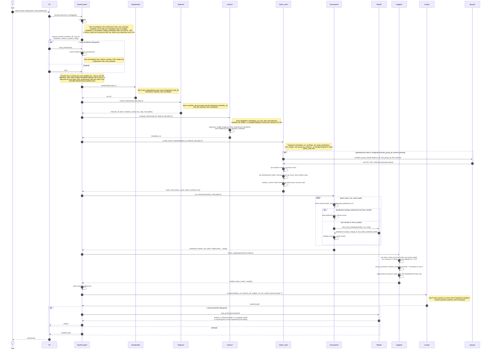

```mermaid
%%{init: {'theme': 'default'}}%%
sequenceDiagram
    autonumber
    actor User
    participant CLI as "cli"
    participant SC as "SynthCurator"
    participant STD as "standardize"
    participant FEAT as "features"
    participant MET as "metrics"
    participant MS as "metric_sets"
    participant TOUR as "tournament"
    participant MODEL as "Model"
    participant WGT as "weights"
    participant CUR as "curate"
    participant GRP as "groups"

    User->>CLI: synth-curator config.yaml [--train-production]
    CLI->>SC: SynthCurator.from_config(path)
    SC->>SC: _validate()
    Note right of SC: fails immediately if the model lacks train_and_evaluate,<br/>synthetic_dir or real_dir is missing or has no images,<br/>resolution is not positive, target_distribution does not sum to ~100,<br/>or metric_beta and scoring are both set, before any expensive work runs
    SC-->>CLI: instance (model, synthetic_dir, real_dir,<br/>resolution, metrics, curation config)

    alt --train-production flag given
        CLI->>SC: train_production()
        SC->>SC: check model has train_production()
        Note right of SC: fails immediately here, before curating, if the model only<br/>implements train_and_evaluate
    else default
        CLI->>SC: run()
    end

    Note over SC: full path only, no bring-your-own-weights yet - run() is one flat<br/>sequence, each step's output threaded explicitly into the next, no<br/>step pulls its own input. train_production() calls this same run()<br/>internally before doing anything extra

    SC->>STD: standardize() [step 1]
    Note right of STD: skip if real_standardized exists and its fingerprint (real_dir,<br/>resolution) matches, else recompute
    STD-->>SC: std_dir

    SC->>FEAT: extract_features(std_dir) [step 2]
    Note right of FEAT: skip if synthetic_dino.pt exists and the fingerprint (synthetic_dir,<br/>real_dir) matches, else recompute
    FEAT-->>SC: features_dir (dino, inception, probs, knn_map, real_labels)

    SC->>MET: compute_metrics(std_dir, features_dir) [step 3]
    Note right of MET: base metadata is metadata_csv if set, else scanned from<br/>synthetic_dir folders - a changed fingerprint clears the cached CSV first
    MET->>MET: paired.py / single_image.py / from_features.py calculators,<br/>each skipping columns already computed
    MET-->>SC: metadata_csv

    SC->>MS: curate_metric_sets(metadata_csv, features_dir) [step 4]
    Note right of MS: fingerprint (metadata_csv, synthetic_dir, target_distribution,<br/>num_images, dist_group_by, metrics) - a changed fingerprint clears<br/>metric_sets/ first
    opt distributional metrics configured and dist_group_by columns present
        MS->>GRP: compute_group_raw(df, features_dir, dist_group_by, dist_metrics)
        GRP-->>MS: raw FID / KID / SWD per generation group
    end
    MS->>MS: per instance metric: top-N per class
    MS->>MS: per distributional metric: best group by raw score, then random draw
    MS->>MS: random_control: fresh random per-class draw, one per seed
    MS-->>SC: metric_sets {metric_name: {seed: manifest.csv}}

    SC->>TOUR: run_tournament(metric_sets) [step 5]
    loop each metric_set x each seed
        TOUR->>TOUR: check cache {metric_set}_seed{seed}_predictions.csv
        alt predictions already cached and not force_retrain
            TOUR-->>TOUR: load predictions.csv, log the reuse
        else not cached, or force_retrain
            TOUR->>MODEL: train_and_evaluate(manifest_csv, seed)
            MODEL-->>TOUR: predictions (unique_image_id, true_label, predicted_label)
            TOUR->>TOUR: validate columns, cache to disk
        end
    end
    TOUR-->>SC: predictions {metric_set_name: DataFrame[..., seed]}

    SC->>WGT: derive_weights(predictions) [step 6]
    WGT->>WGT: per class: mean score per metric set across seeds,<br/>via scoring or F-metric_beta by default (2.0 = F2)
    WGT->>WGT: worst_anchored / random_anchored formula -> normalize to sum 1
    WGT->>WGT: optional dist_formula re-split within the distributional share only
    WGT-->>SC: weights {class: {metric: weight}}
    SC->>SC: write workdir/weights.json

    SC->>CUR: curate(metadata_csv, features_dir, weights, out_dir, curation params) [step 7]
    Note right of CUR: skip if seed_{seed}.csv exists and its fingerprint (weights +<br/>curation params) matches, else recompute
    CUR-->>SC: manifest path

    alt --train-production flag given
        SC->>MODEL: train_production(manifest)
        MODEL-->>SC: artifact, a checkpoint path or a wrapped model<br/>or anything else, never inspected by the library
        SC-->>CLI: artifact
    else default
        SC-->>CLI: manifest path
    end
    CLI-->>User: print(result)
```
