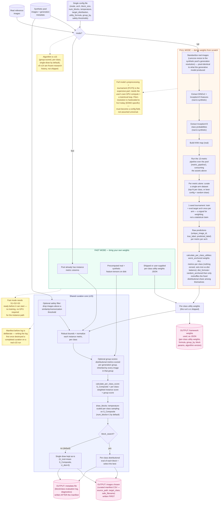

```mermaid
%%{init: {'theme': 'default'}}%%
flowchart TD
    CFG[["Single config file<br/>(mode, arch, block_size,<br/>num_blocks, temperature,<br/>target_distribution,<br/>utility_formula, group_by,<br/>safety thresholds)"]]
    POOL[("Synthetic pool<br/>images + generation<br/>metadata")]
    REAL[("Real reference<br/>images")]

    MODE{"mode?"}
    CFG --> MODE
    POOL --> MODE
    REAL --> MODE

    subgraph FULL["FULL MODE — derive weights from scratch"]
        F0a["Standardize real images<br/>(Lanczos resize to the<br/>synthetic pool's generation<br/>resolution) — pixel-identical<br/>to what the generative<br/>model produced"]
        F0b["Extract DINOv2 +<br/>InceptionV3 features<br/>(real & synthetic)"]
        F0c["Extract InceptionV3<br/>class probabilities<br/>(real & synthetic)"]
        F0d["Build KNN map (real)"]
        F1["Run the 13-metric<br/>pipeline over the pool<br/>(metric_pipeline/), consuming<br/>the assets above"]
        F2["Per metric alone: curate<br/>a single-arm dataset<br/>(top-N per class, or best-<br/>config + random draw)"]
        F3["1-seed tournament: train<br/>+ eval target arch once per<br/>arm — a signal for weighting,<br/>not a statistical claim"]
        F4["Raw predictions<br/>(unique_image_id,<br/>true_label, predicted_label)<br/>per metric per arch"]
        F5["calculate_per_class_utilities:<br/>worst_anchored weights ALL<br/>metrics per class (nothing<br/>zeroed, sets inst-vs-dist<br/>balance); dist_formula=<br/>random_anchored then only<br/>reshuffles the fixed<br/>distributional share among<br/>themselves"]
        F0a --> F0b --> F0c --> F0d --> F1
        F1 --> F2 --> F3 --> F4 --> F5
    end

    subgraph FAST["FAST MODE — bring your own weights"]
        S1["Pool already has instance<br/>metric columns"]
        S2["Precomputed real + synthetic<br/>feature tensors on disk"]
        S3["Shipped or user-supplied<br/>per-class utility weights JSON"]
    end

    MODE -- "full" --> F0a
    MODE -- "fast" --> S1

    W["Per-class utility weights<br/>(this run's or shipped)"]
    F5 --> W
    S3 --> W

    subgraph CORE["Shared curation core (v15)"]
        C0["Optional safety filter:<br/>drop images above a<br/>similarity/memorization<br/>threshold"]
        C1["Robust bounds + normalize<br/>each instance metric,<br/>per class"]
        C2["Optional group scores:<br/>distributional metrics scored<br/>per generation group,<br/>inherited by every image<br/>in that group"]
        C3["calculate_per_class_score:<br/>S_Composite = per-class-<br/>weighted instance score<br/>+ group score"]
        C4["draw_blocks: temperature-<br/>scaled per-class sampling<br/>on S_Composite<br/>(num_blocks=1 by default)"]
        C5{"block_search?"}
        C6["Per-class distributional<br/>eval of each block +<br/>select the best"]
        C7["Single draw kept as-is<br/>(U_inst=mean S_Composite,<br/>U_dist=0)"]
        C0 --> C1 --> C2 --> C3 --> C4 --> C5
        C5 -- "yes" --> C6
        C5 -- "no (default)" --> C7
    end

    W --> C1
    S1 --> C1
    S2 --> C2
    POOL --> C0

    MANIFEST[("OUTPUT: images chosen<br/>(curated manifest CSV —<br/>source_path, target_class,<br/>safe_filename)<br/>written FIRST")]
    LOG[("OUTPUT: metadata file<br/>(block/class evaluation log,<br/>diagnostics)<br/>written AFTER the manifest")]
    WEIGHTSOUT[("OUTPUT: framework weights<br/>used, as JSON<br/>(per-class utility weights,<br/>formula, group_by, block<br/>params, algorithm version)")]

    C6 --> MANIFEST
    C7 --> MANIFEST
    C6 --> LOG
    C7 --> LOG
    W --> WEIGHTSOUT

    NOTE1[["Fast mode needs S1+S2+S3<br/>ready before it can start —<br/>no training, no GPU required<br/>for the instance path"]]
    NOTE2[["Full mode's preprocessing +<br/>tournament (F0-F5) is the<br/>expensive part: needs the<br/>user's own GPU compute +<br/>a train/eval loop. F0a's<br/>resolution is hardcoded to<br/>512 today (EDM2-specific) —<br/>must become a config field,<br/>not assumed universal."]]
    NOTE3[["Manifest before log is<br/>deliberate — writing the log<br/>first once destroyed a<br/>completed curation on a<br/>real v15 run"]]
    NOTE4[["Algorithm is v15<br/>(group-scored, per-class,<br/>single-draw by default).<br/>v5-v14 are frozen research<br/>history, not shipped."]]

    FAST -.-> NOTE1
    FULL -.-> NOTE2
    CORE -.-> NOTE3
    MODE -.-> NOTE4

    classDef shared fill:#eef2ff,stroke:#6366f1,color:#1e1b4b;
    classDef fullmode fill:#fff7ed,stroke:#ea580c,color:#7c2d12;
    classDef fastmode fill:#ecfdf5,stroke:#059669,color:#064e3b;
    classDef callout fill:#fef9c3,stroke:#ca8a04,color:#713f12,stroke-dasharray: 4 3;
    classDef output fill:#fce7f3,stroke:#db2777,color:#831843;

    class CORE shared;
    class FULL fullmode;
    class FAST fastmode;
    class NOTE1,NOTE2,NOTE3,NOTE4 callout;
    class MANIFEST,LOG,WEIGHTSOUT output;
```
